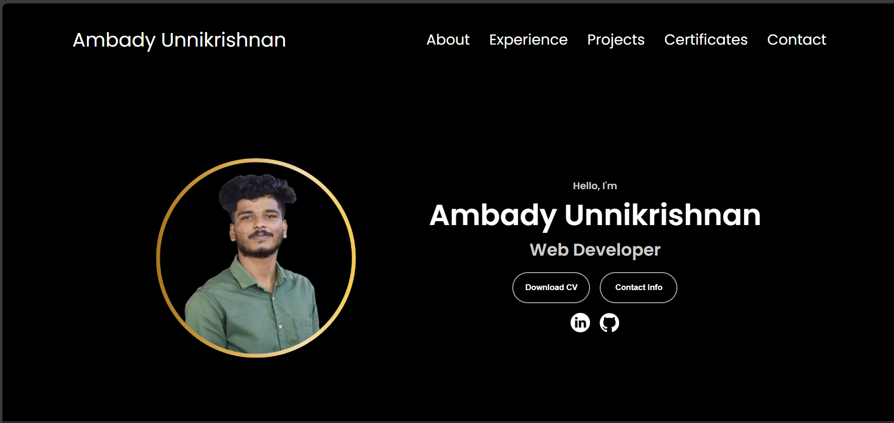

# 💼 Ambady Unnikrishnan – Portfolio Website

A personal portfolio website showcasing my skills, projects, certifications, and experience in web and software development. The site contains sections like **About Me**, **Experience**, **Projects**, **Certificates**, and **Contact**, and is built with a responsive layout and interactive UI.

---

## 🌐 Live Demo

🚀 [View My Portfolio Website](https://ambadyunnikrishnan.netlify.app/)

## 📂 Project Structure

portfolio/
├── assets/           # Resume PDF, images, icons
├── index.html        # Main portfolio webpage
├── style.css         # Global styles (desktop)
├── mediaqueries.css  # Responsive design styles
├── script.js         # JavaScript for menu toggle and interactions
└── README.md         # This file

---

## ✨ Features

- Sticky and responsive navigation bar
- Animated hamburger menu for mobile view
- CV download functionality
- Sections: About, Experience & Skills, Projects, Certificates, Contact
- Smooth scrolling and anchor navigation
- Clean and minimal design with focus on readability

---

## 🔧 Built With

- HTML5
- CSS3 (Flexbox, Media Queries, Tailwind used in projects)
- JavaScript (Vanilla)
- React.js, Django (featured in projects)

---

## 🧾 Experience (summary)

- React.js Developer Intern — ALLPRO TECHLABS (May 2025 – Aug 2025)
	- Built responsive React + Tailwind applications, integrated REST APIs, implemented reusable hooks and Context-based state management, and worked in Agile sprints using Git/GitHub.
- Software Developer Intern — Corezone Solution
	- Performed web development tasks, testing, documentation, and worked with Django and SQLyog.
- Education: BCA — Ettumanoorappan College (2022 - 2025)

For full details, see the **Experience & Skills** section on the live site (`index.html`).

---

## 🛠️ Skills

Languages:
- PHP, Python, JavaScript, Java, C++

Development & Architecture:
- OOP, MVC (Django), REST APIs, Agile methodologies, Node.js, Express.js, MongoDB (MERN stack)

Databases:
- MySQL, SQLyog, CRUD operations, database normalization

Frameworks & Libraries:
- React.js, Tailwind CSS, Django, Bootstrap

Front-End:
- HTML, CSS, JavaScript, jQuery, Ajax

Operating Systems:
- Windows, Linux, Unix (basic shell scripting)

Tools:
- Git, VS Code, Visual Studio, MS Office

---

## 🖼️ Preview

---

## 📧 Contact

- **👤 Name**: Ambady Unnikrishnan  
- **📍 Location**: Kottayam, Kerala, India  
- **📫 Email**: ambadyunnikrishnan2000@gmail.com  
- **🌐 Website**: [ambady-unnikrishnan.dev](https://ambadyunnikrishnan.netlify.app/)

---

## 📄 License

This project is licensed under the [MIT License](LICENSE).

---

> Created with ❤️ by **Ambady Unnikrishnan**
